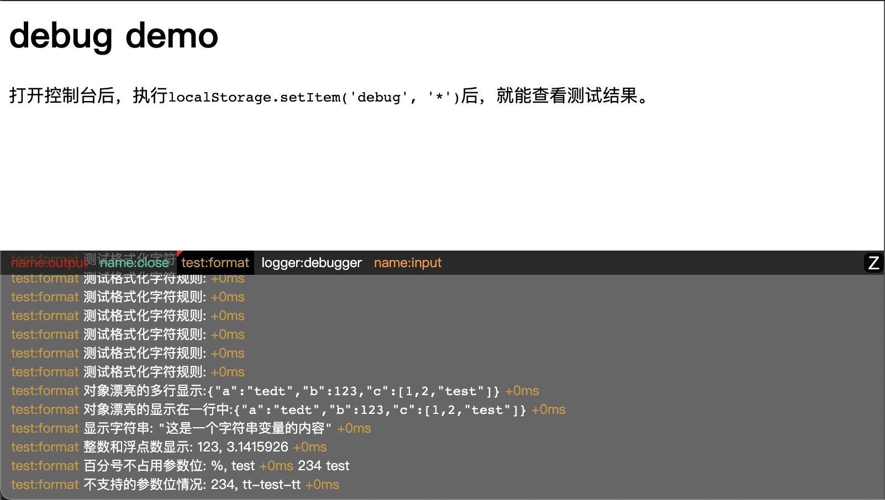

> A tiny JavaScript debugging utility, Works in web browsers.

用于在浏览器中显示日志，项目从 [debug](https://github.com/visionmedia/debug/) 修改而来，**减小仓库文件大小**更适用浏览器环境。

### 改进点

- 项目用 TypeScript 改写。
- 支持多 JS 文件共用配置定义。
- 提供在页面中显示日志的方法。



### namespace 规则

用于定义一个日志的的命令空间，用于定义此命令空间的日志在特定规则下是否显示。

特性：
- 支持同时设置多个 namespace，每个使用空格或逗号分隔。如 `name1, name2:*,-name2:test`
- 支持在字符串**末尾**加 `*` 来匹配所有字符。如 `app:*`能匹配所有 app: 开头的 namespace。
- 支持在字符串**头部**加 `-` 来排除对应的 namespace。如 `-not_this:*` 能排除所有 not_tihs 开头的 namespace。

> 注意：namespace 中不要出现`%`字符，否则会对设置颜色等操作有影响

namespace 的特性在设置显示哪些日志时使用，比如：

```js
import createDebug from 'zlog-web';

// 设置日志显示规则
createDebug.enable('name:*,-name:input');

// 定义 debug
const input = createDebug('name:input');
const output = createDebug('name:output');
const ctrl = createDebug('name:ctrl');

// 打印日志
input('test input'); // 当前 namespace 规则，此日志不会显示
input('test output');
input('test ctrl');
```

### Formatters

调试使用 [printf-style](https://wikipedia.org/wiki/Printf_format_string) 的格式。以下是官方支持的格式化程序：

| Formatter |  表现                                                        |
| --------- | ----------------------------------------------------------- |
| `%O`      | 在多行上漂亮地打印对象。                                        |
| `%o`      | 将对象漂亮地打印在一行上。                                      |
| `%s`      | 字符串。|
| `%d`      | 数字（对浮点数会取整）                                          |
| `%f`      | 浮点数字                                                     |
| `%%`      | 单个百分号（'％'）。这不消耗参数。                               |

修改格式对象：

```js
import createDebug from 'zlog-web';
createDebug.formatters.h = (v) => {
  return v.toString('hex');
}

// …elsewhere
const debug = createDebug('foo');
debug('this is hex: %h', new Buffer('hello world'));
//   foo this is hex: 68656c6c6f20776f726c6421 +0ms
```

### 在网页中显示日志

库中已将`log`方法对外暴露，覆盖后就能按自己的意愿来显示，项目中提供了一种在网页中显示日志的方法，再结合 URL 参数开关就可在 H5 端显示漂亮的日志了。

```js
import createDebug from 'zlog-web';
import show2Html from 'zlog-web/show2Html';

if(/\bdebugType=html\b/.test(window.location.search)) {
  show2Html(Debug);
}
```
